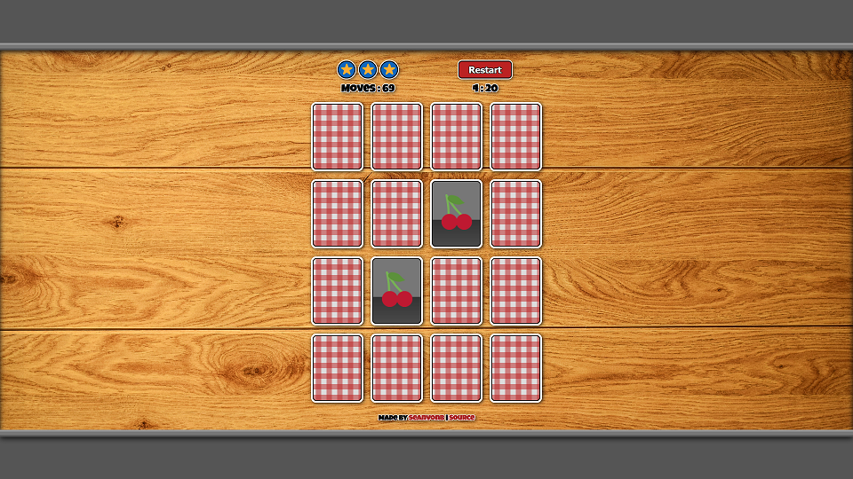

# Memory Game

[LIVE PREVIEW](https://seanvonb.github.io/memory-game/)

This card-matching game is a project that I originally did in 2018; but, more recently, I decided to fix a few issues, implement a proper card flipping effect, and generally polish the overall look. It was a worthwhile refresher on how to use timers, both in the case of the clock and the animations, and I tried to build as much of the page as I could using JavaScript, which was a good challenge. Give it a shot – my record is 0:21 in 11 moves!

## Features

-   Match 8 pairs of cards as quickly and/or in as few moves as you can
-   Try three different decks with distinct themes
-   Marvel at the super beautiful card flip effect – ooh, aah!
-   View consistent icons across devices thanks to the Twemoji API

## Credits

-   This project was part of my [Front End Web Developer Nanodegree](https://www.udacity.com/course/front-end-web-developer-nanodegree--nd0011).
-   "Twemoji" is owned by Twitter of California, USA.

## License

Copyright © 2018-2022 Sean von Bayern  
Licensed under the [MIT License](LICENSE.md)
